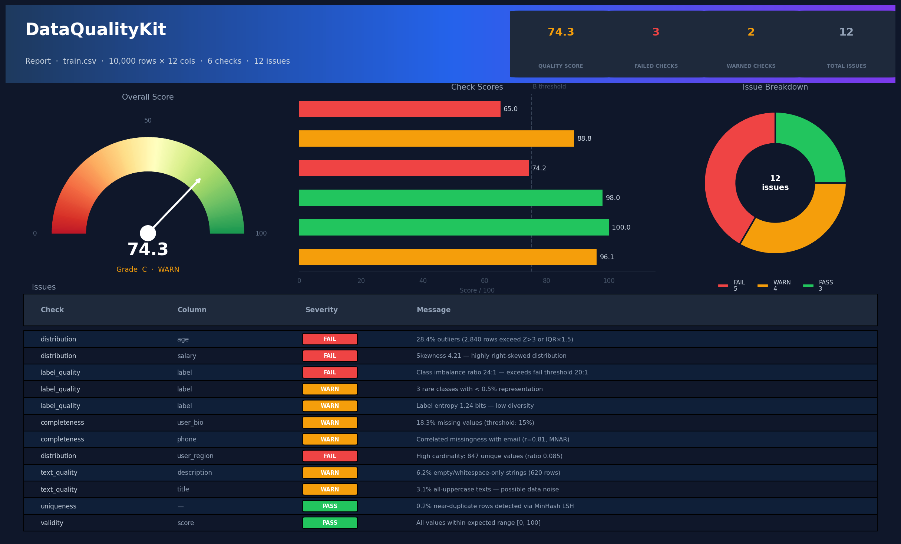

<div align="center">


[](https://github.com/Darsh-Nandu/data-quality-kit/actions)
[](https://github.com/Darsh-Nandu/data-quality-kit)
[](https://github.com/Darsh-Nandu/data-quality-kit/tree/main/tests)
[](https://www.python.org)
[](LICENSE.md)
[](https://github.com/astral-sh/ruff)

<br/>

> **DQK** audits your datasets across **six quality dimensions**, detects **distribution drift** between training and production data, and generates **interactive Plotly dashboards** - all in a single command.

```bash
pip install dataqualitykit
dqk check train.csv --fail-under 80 --output report.html
```

</div>

---

## Why DataQualityKit?

Garbage in, garbage out. Most ML failures trace back to data - missing values, silent type errors, severe class imbalance, training-serving skew. DQK makes these problems **visible and measurable** before they reach your model.

| | Feature |
|---|---|
| 🔍 | **Six specialized checks** - completeness, validity, uniqueness, distributions, text quality, label quality |
| 📊 | **Interactive HTML dashboards** - shareable Plotly reports, no server needed |
| 📡 | **Drift detection** - PSI, KS test, Jensen-Shannon divergence, and chi-squared |
| 🚦 | **CI/CD ready** - fail your pipeline if data quality drops below a score threshold |
| 🔌 | **Plugin system** - register custom checks with a single decorator |
| 🌐 | **Multi-source** - CSV, Parquet, JSON, HuggingFace Hub, SQL, pandas, polars |

---

## Quickstart

```python
from dqk.core.dataset import DQKDataset

# Load from any source
ds = DQKDataset.from_csv("train.csv")
ds = DQKDataset.from_parquet("data.parquet")
ds = DQKDataset.from_huggingface("imdb", split="train")
ds = DQKDataset.from_dataframe(my_df)

# Run all checks
report = ds.run_checks(label_col="target")

print(f"Quality Score: {report.score.overall:.1f}/100  Grade: {report.score.grade}")
# → Quality Score: 87.4/100  Grade: B

# Save interactive dashboard
report.save("report.html")   # Plotly dashboard
report.save("report.json")   # Machine-readable JSON
```

**Sample CLI output:**

```
Loaded: 10,000 rows × 12 cols (csv)

Quality Score: 74.3/100  (C)  WARN

┌──────────────┬───────┬──────────┬─────────┐
│ Check        │ Score │ Severity │ Issues  │
├──────────────┼───────┼──────────┼─────────┤
│ completeness │ 0.961 │ warn     │ 2       │
│ validity     │ 1.000 │ pass     │ 0       │
│ uniqueness   │ 0.980 │ pass     │ 1       │
│ distribution │ 0.742 │ fail     │ 4       │
│ text_quality │ 0.888 │ warn     │ 2       │
│ label_quality│ 0.650 │ fail     │ 3       │
└──────────────┴───────┴──────────┴─────────┘
```

---

## Sample Report

<div align="center">
  
  <sub><i>Interactive HTML report - gauge score, per-check bars, issue breakdown donut, and full issue table</i></sub>
</div>

---

## The Six Checks

<table>
<thead>
<tr>
<th width="160">Check</th>
<th width="80" align="center">Weight</th>
<th>What It Catches</th>
</tr>
</thead>
<tbody>

<tr>
<td>🧩 <b>completeness</b></td>
<td align="center">1.5×</td>
<td>Per-column null rates, empty columns, row-level completeness, correlated missingness (MNAR pattern detection via Pearson correlation)</td>
</tr>

<tr>
<td>✅ <b>validity</b></td>
<td align="center">1.2×</td>
<td>Type conformance, custom range guards <code>{col: (min, max)}</code>, regex pattern guards <code>{col: pattern}</code>, constant column detection</td>
</tr>

<tr>
<td>🔑 <b>uniqueness</b></td>
<td align="center">1.0×</td>
<td>Exact row duplicates, key-column violations, fuzzy near-deduplication via MinHash LSH (optional, <code>pip install datasketch</code>)</td>
</tr>

<tr>
<td>📈 <b>distribution</b></td>
<td align="center">1.0×</td>
<td>Z-score and IQR outlier detection, skewness / kurtosis, near-constant columns, high-cardinality categoricals, rare category flagging</td>
</tr>

<tr>
<td>📝 <b>text_quality</b></td>
<td align="center">0.8×</td>
<td>Empty / whitespace strings, extreme length outliers, all-caps noise ratio, exact text duplicates, optional language consistency (langdetect)</td>
</tr>

<tr>
<td>🏷️ <b>label_quality</b></td>
<td align="center"><b>1.3×</b></td>
<td>Class imbalance ratio (warn ≥ 5:1, fail ≥ 20:1), rare class detection, normalized label entropy, missing label rate</td>
</tr>

</tbody>
</table>

> Checks are weighted during aggregation. `label_quality` carries the highest weight (1.3×) because label noise has the most direct impact on model training.

```python
# Run a specific subset
report = ds.run_checks(checks=["completeness", "distribution", "label_quality"])
```

---

## Drift Detection

Compare training data against production (or any two snapshots) to catch distribution shift **before your model degrades silently**.

```python
from dqk.core.dataset import DQKDataset
from dqk.drift import compare_datasets

train = DQKDataset.from_csv("train.csv")
prod  = DQKDataset.from_csv("production.csv")

drift = compare_datasets(train, prod)

print(f"Overall drift: {drift.overall_severity.value}")   # none | moderate | severe
print(f"Drifted columns: {len(drift.drifted_columns)}/{len(drift.column_results)}")

for col in drift.drifted_columns:
    print(f"  [{col.severity.value:8}] {col.column:20} {col.note}")
```

```
Overall drift: moderate
Drifted columns: 2/7
  [moderate ] age                  PSI=0.143, KS=0.112 (p=0.0031)
  [severe   ] user_region          JS-div=0.341, χ²=84.21 (p=0.0000)
```

### Drift thresholds

| Test | Metric | Moderate | Severe |
|---|---|---|---|
| **PSI** | Numeric distributions | ≥ 0.10 | ≥ 0.25 |
| **KS test** | Numeric shape change | p < 0.05 | p < 0.001 |
| **JS Divergence** | Categorical proportions | ≥ 0.10 | ≥ 0.30 |
| **Chi-squared** | Categorical frequencies | p < 0.05 | p < 0.001 |

Schema changes (added, removed, or type-changed columns) are also reported in `drift.schema_diff`.

---

## CLI Reference

```
dqk check <source>        Run all quality checks
dqk compare <ref> <cur>   Drift detection between two datasets
dqk schema <source>       Print inferred column schema
dqk list-checks           List all available check names
```

### `dqk check`

```bash
# Basic audit
dqk check data.csv

# Force fail if quality drops below threshold (CI-friendly)
dqk check data.csv --fail-under 80

# Run specific checks and save HTML report
dqk check data.csv --checks completeness,validity,distribution -o report.html

# HuggingFace dataset
dqk check imdb --format hf --split test
```

### `dqk compare`

```bash
dqk compare train.csv production.csv
dqk compare train.csv production.csv --columns age,score,region --output drift.json
```

---

## CI/CD Integration

Drop data quality into your pipeline as a hard gate:

```yaml
# .github/workflows/train.yml
- name: Data Quality Gate
  run: |
    pip install dataqualitykit
    dqk check data/train.csv --fail-under 80 --output artifacts/report.html
```

Exit code `0` = passes threshold. Exit code `1` = fails → blocks the pipeline.

---

## Data Sources

| Source | Constructor | Notes |
|---|---|---|
| CSV | `from_csv("data.csv")` | Any `pandas.read_csv` kwargs accepted |
| Parquet | `from_parquet("data.parquet")` | |
| JSON / JSONL | `from_json("data.jsonl")` | Auto-detects array vs. lines |
| HuggingFace Hub | `from_huggingface("imdb", split="train")` | Requires `pip install datasets` |
| SQL | `from_sql("postgresql://...", query=...)` | SQLAlchemy connection string |
| pandas DataFrame | `from_dataframe(df)` | |
| polars DataFrame | `from_dataframe(df)` | Auto-detected |

---

## Plugin System

Register custom checks without modifying library source:

```python
from dqk.scoring.scorer import register_check
from dqk.checks.base import BaseCheck, CheckSeverity

@register_check
class PIICheck(BaseCheck):
    name = "pii_detection"
    description = "Detect columns containing PII (emails, phone numbers, SSNs)"
    weight = 1.5

    def run(self, dataset):
        result = self._empty_result()
        import re
        email_pattern = re.compile(r"[a-zA-Z0-9_.+-]+@[a-zA-Z0-9-]+\.[a-zA-Z0-9-.]+")
        for col in dataset.schema.text_columns:
            series = dataset.df[col].dropna().astype(str)
            hits = series.str.contains(email_pattern).sum()
            if hits > 0:
                result.add_issue(
                    f"Column '{col.name}' contains {hits} email addresses.",
                    column=col.name,
                    severity=CheckSeverity.FAIL,
                )
        result.score = 0.0 if result.issues else 1.0
        return result

# Now available everywhere
report = ds.run_checks(checks=["completeness", "pii_detection"])
```

---

## Scoring

The overall score is a **weighted average** of all active check scores, scaled 0–100:

```
overall = Σ(check_score × weight) / Σ(weight)  × 100
```

Checks that produce `SKIP` (e.g. `text_quality` on a dataset with no text columns) are excluded from the denominator.

| Score | Grade | Meaning |
|---|---|---|
| 90 – 100 | **A** 🟢 | Production-ready |
| 75 – 89  | **B** 🟡 | Minor issues, review recommended |
| 60 – 74  | **C** 🟠 | Significant issues, fix before training |
| 40 – 59  | **D** 🔴 | Major problems |
| 0 – 39   | **F** ⛔ | Do not use for training |

---

## Architecture

```
dataqualitykit/
│
├── dqk/
│   ├── checks/
│   │   ├── base.py              CheckResult · CheckIssue · BaseCheck
│   │   ├── completeness.py      Null rates · MNAR pattern detection
│   │   ├── validity.py          Types · range guards · regex guards
│   │   ├── uniqueness.py        Exact dedup · MinHash fuzzy dedup
│   │   ├── distribution.py      Outliers · skewness · cardinality
│   │   ├── text_quality.py      Length · empty · all-caps · langdetect
│   │   └── label_quality.py     Imbalance · rare classes · entropy
│   │
│   ├── core/
│   │   ├── dataset.py           DQKDataset - main entry point
│   │   ├── loader.py            CSV · JSON · Parquet · HF · SQL · Polars
│   │   └── schema.py            DatasetSchema · ColumnMeta · ColumnDtype
│   │
│   ├── scoring/
│   │   └── scorer.py            Weighted aggregation · Plotly report · registry
│   │
│   ├── drift.py                 PSI · KS · JS-divergence · chi-squared
│   └── cli.py                   Typer CLI - check · compare · schema · list-checks
│
└── tests/
    ├── test_checks.py           46 tests · bug regressions · drift · scoring
    └── test_dataset.py          Core dataset tests
```

### Data flow

```
  Source (CSV / Parquet / HF / SQL / DataFrame)
       │
       ▼
  DQKDataset  ──► DatasetSchema (column dtypes, roles, stats)
       │
       ▼
  run_checks()
       │
       ├──► CompletenessCheck  ──┐
       ├──► ValidityCheck       │
       ├──► UniquenessCheck     ├──► CheckResult (score, severity, issues, metrics)
       ├──► DistributionCheck   │
       ├──► TextQualityCheck    │
       └──► LabelQualityCheck  ──┘
                                │
                                ▼
                          _aggregate_score()  (weighted average)
                                │
                                ▼
                          QualityReport  ──► .save("report.html")  Plotly dashboard
                                        ──► .save("report.json")  JSON
```

---

## Development

```bash
git clone https://github.com/Darsh-Nandu/data-quality-kit.git
cd data-quality-kit
pip install -e ".[dev]"

# Run tests
pytest tests/ -v --cov=dqk

# Lint
ruff check dqk/

# Type check
mypy dqk/ --ignore-missing-imports
```

### Optional extras

```bash
pip install dataqualitykit[text]    # langdetect + presidio PII detection
pip install dataqualitykit[labels]  # cleanlab label noise detection
pip install dataqualitykit[all]     # everything
```

---

## License

MIT © [Darsh Nandu](https://github.com/Darsh-Nandu)

<div align="center">

</div>